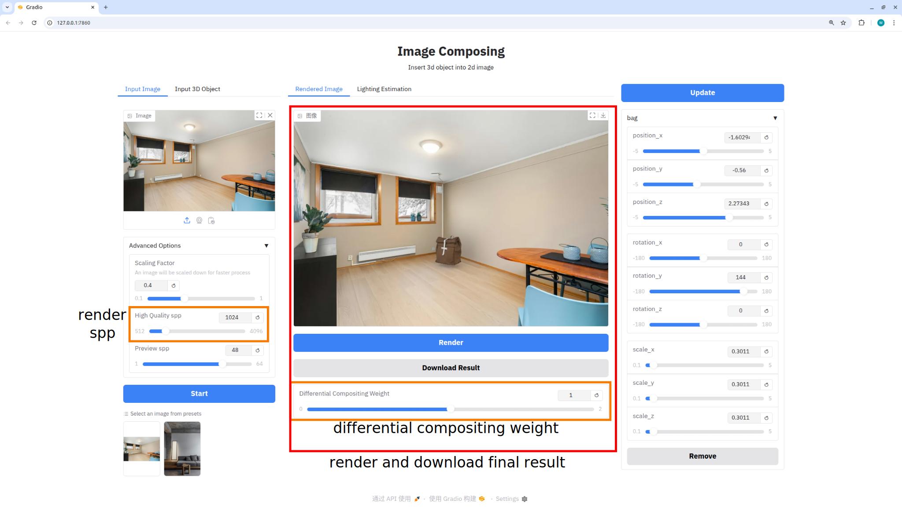

# Image Composing with 3D Object

Implementation of the interface from *Interactive Object Insertion with Differentiable Rendering*.

## Requirements
This code is developed and tested on a workstation with the following configuration:
* OS: Ubuntu22.04
* Mem: 64GB
* CPU: i9-14900k
* GPU: RTX4090

A computer with a Nvidia GPU with at least 12GB CUDA memory should work.

## Installation

1. First clone the repository as well as the submodules.

    ```bash
    git clone --recursive https://github.com/willipwk/image-composing.git
    ```
2. Create conda environment with python3.10.
3. Install `torch`. This repo is tested on `torch==2.4.0+cu124`.
4. Install other dependencies with `pip install -r requirements.txt`. One thing to note about is gradio's version. `gradio==4.44.1` seems to have [display issue](https://github.com/gradio-app/gradio/issues/9305) in its ImageEditor interface. They fix this issue in [this pull request](https://github.com/gradio-app/gradio/pull/10357). If you meet the display issue when using ImageEditor, please install gradio via `pip install https://gradio-pypi-previews.s3.amazonaws.com/9d27e43d5aa44ecfb6df0f2d7540e767c55b52b5/gradio-5.12.0-py3-none-any.whl`.
5. Goto MoGe's directory and install its dependecies
    ```bash
    cd MoGe
    pip install -r requirements.txt
    cd ..
    ```
6. Goto Intrinsic's directory and install its dependencies
    ```bash
    cd Intrinsic
    pip install .
    cd ..
    ```
## Usage
1. Launch the GUI by `python GUI.py`. You can open a web GUI at `http://127.0.0.1:7860`. The GUI should look like this
    
2. You can select our example images in below or upload your own image.
3. (Optional) After loading the original image, you can specify the light source in the ImageEditor with brush. If you don't specify, the program will try to infer light source automatically.
    
4. Then click `Start` button. The program will first reconstruct the geometry as well as image intrinsic channels of the input image, and then estimate the lighting condition of the scene. Finally, it will render and display a reconstructed image with estimated geometry and lights with `Mitsuba`.
    
5. Now you can find some 3D objects shown in the left column. Select on and then click a pixel in the image to insert it.
    
6. You can find the object is in the image. There are some adjustable parameters in the right column for you to further modify the configuration of the object.
   1. You can adjust the object's position, orientation and scale at different axes.
   2. If you want to insert another object, just select one in the left column and click the image again.
   3. If you want to delect an object, click the `Remove` button of the object you want to delect, and then click `Update` to update the GUI.
   4. If you find the rendering speed is too slow, you can adjust the  `Preview spp` in the `Advanced Option`. The lower spp you set, the poor preview quality but faster rendering you will get.
   
7. When you are satify with the insertion configuration, click `Render` button below the image to get a high quality image. And click `Download Result` button to save the result. There are some hyper-parameters to control the final result. In the right column you can find a slide bar called `High Quality spp`. The higher of the spp value the better rendering result you can get. By default, 1024 spp can give you a nice image. Another tunable parameter is the `Differential Compositing Weight`. Our program composites the original image and the re-rendered image with inserted objects. This weight determines how much weight should be put on the re-rendered image when compositing them together.
    

Enjoy playing with our application!
    
